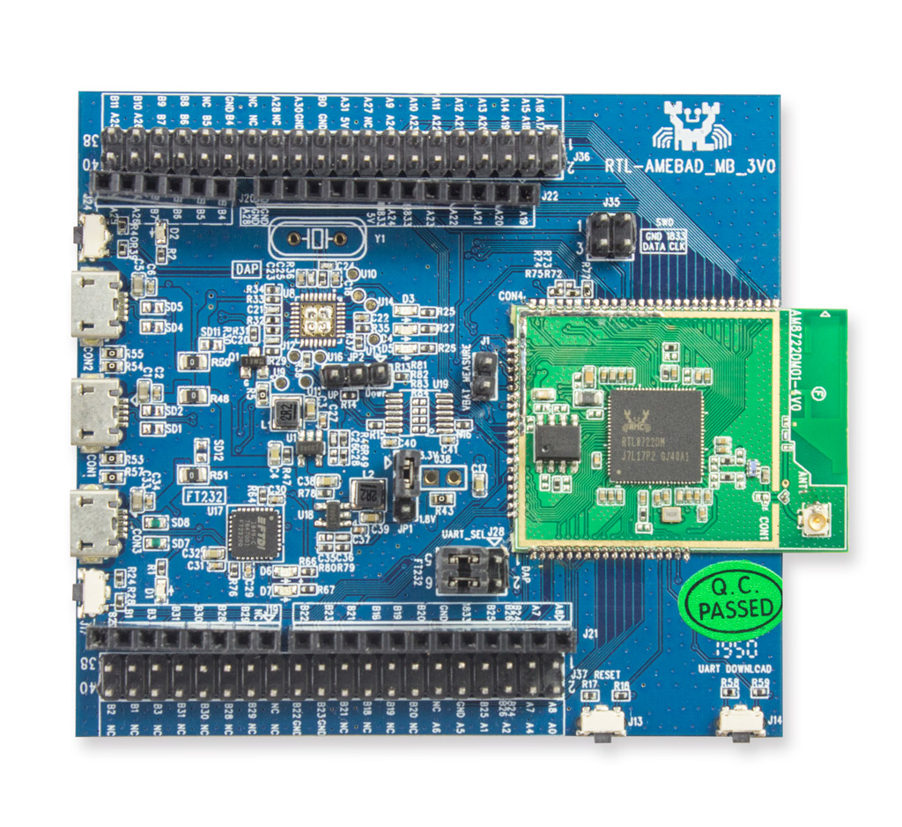

.. Copyright 2020-2023 MicroEJ Corp. All rights reserved._
.. Use of this source code is governed by a BSD-style license that can be found with this software.

.. |BOARD_NAME| replace:: Ameba RTL8722DM
.. |BOARD_REVISION| replace:: RTL-AMEBAD_MB_3V0
.. |VEEPORT_VER| replace:: 1.0.2
.. |RCP| replace:: MICROEJ SDK
.. |VEEPORT| replace:: VEE Port
.. |VEEPORTS| replace:: VEE Ports
.. |SIM| replace:: MicroEJ Simulator
.. |ARCH| replace:: MicroEJ Architecture
.. |CIDE| replace:: MICROEJ SDK
.. |RTOS| replace:: FreeRTOS RTOS
.. |MANUFACTURER| replace:: Realtek
.. |MANUFACTURER_SDK_VER| replace:: sdk-amebad_v6.2C-RC+patch_221206_bf3b2a72+patch_mbedtls-2.27.0_221230_v01
.. |TOOLCHAIN| replace:: IAR Embedded Workbench for Arm
.. |TOOLCHAIN_VER| replace:: 8.32.1

.. _中文版: ./docs/zn_CH/README_CN.rst
.. _README MicroEJ BSP: ./Ameba-RTL8722DM-bsp/README.rst
.. _RELEASE NOTES: ./RELEASE_NOTES.rst
.. _CHANGELOG: ./CHANGELOG.rst

.. image:: https://shields.microej.com/endpoint?url=https://repository.microej.com/packages/badges/sdk_5.6.json
   :alt: sdk_5.6 badge
   :align: left

.. image:: https://shields.microej.com/endpoint?url=https://repository.microej.com/packages/badges/arch_7.16.json
   :alt: arch_7.16 badge
   :align: left

==========================================
|VEEPORT| for |MANUFACTURER| |BOARD_NAME|
==========================================

`中文版`_

This project is used to build a  |VEEPORT| for the |BOARD_NAME| .

=============
Related Files
=============

This directory also contains:

* `CHANGELOG`_ to track the changes in the |VEEPORT| for |BOARD_NAME| 
* `RELEASE NOTES`_ to list:

  - the supported hardware,
  - the known issues and the limitations,
  - the development environment,
  - the list of the dependencies and their versions.

* `README MicroEJ BSP`_ recommended for users familiar with the
  |MANUFACTURER| SDK and advanced usage on how to customize the build
  process.

Board Technical Specifications
==============================
  
.. list-table::
  
  * - Name
    - |BOARD_NAME|
  * - Revision
    - |BOARD_REVISION|
  * - MCU part number
    - RTL8722DM-VA1-CG-QFN88
  * - MCU revision
    - N/A
  * - MCU architecture
    - Dual CPU, 32-bit Arm Cortex-M33 (KM4) and 32-bit Arm®Cortex®-M0 (KM0)
  * - MCU max clock frequency
    - KM4: 200 MHz, KM0: 20 MHz
  * - Internal flash size
    - N/A
  * - Internal PSRAM size
    - 4 MB
  * - Internal SRAM size
    - KM4: 512 kB, KM0: 64 kB
  * - SPI flash size
    - 2 MB
  * - Power supply
    - USB

This is a list of |BOARD_NAME| useful documentation you can find `here <https://www.amebaiot.com/en/amebad/>`__ if you create a Realtek account:

- Board schematics
- Board layout 
- Board Reference Manual 
- MCU Datasheet

|VEEPORT| Specifications
========================

The Architecture version is ``7.16.0``.

This |VEEPORT| provides the following Foundation Libraries:

.. list-table::
   :header-rows: 1

   * - Foundation Library
     - Version
   * - BON
     - 1.4
   * - ECOM-NETWORK
     - 2.1
   * - ECOM-WIFI
     - 2.2
   * - EDC
     - 1.3
   * - FS
     - 2.0
   * - NET
     - 1.1
   * - NLS
     - 2.0 
   * - SECURITY
     - 1.4
   * - SNI
     - 1.4
   * - SP
     - 2.0  
   * - SSL
     - 2.2
   * - TRACE
     - 1.1
   * - WATCHDOG 
     - 2.0 

The |VEEPORT| is derived into:

- a Mono-Sandbox |VEEPORT| (default)

Requirements
============

- PC with Windows 10 
- Internet connection to `MicroEJ Central Repository <https://developer.microej.com/central-repository/>`_
- |RCP| Dist. ``21.11`` or higher, available `here <https://developer.microej.com/microej-sdk-software-development-kit/>`_
- |BOARD_NAME| board
- |MANUFACTURER| SDK. The version of the |MANUFACTURER| SDK is |MANUFACTURER_SDK_VER|, please contact Realtek supporter to retrieve all sdk packages.

BSP Setup
=========

- Install the toolchain |TOOLCHAIN| version |TOOLCHAIN_VER|. 
  You can ask the right version of the toolchain `here <https://www.iar.com/products/architectures/arm/iar-embedded-workbench-for-arm/>`__.
- Install the J-LINK tool `here <https://www.segger.com/downloads/jlink/>`__.
- Retrieve the Realtek sdk package, then put Realtek sdk in the folder ``P0236_Ameba-RTL8722DM-Platform/Ameba-RTL8722DM-bsp/sdk`` before the first firmware build.
  The path to the Realtek sdk should be ``P0236_Ameba-RTL8722DM-Platform/Ameba-RTL8722DM-bsp/sdk/sdk-amebad_v6.2C-RC``.
  The software version should be |MANUFACTURER_SDK_VER|. Please contact Realtek support to retrieve all software packages.

Windows Toolchain
-----------------

- C/C++ toolchain name: IAR compiler
- C/C++ toolchain version: 8.3
- C/C++ toolchain download link: https://www.iar.com/products/architectures/arm/iar-embedded-workbench-for-arm

BSP Compilation
---------------

The |VEEPORT| provides a pre-compiled Mono-Sandbox Application.
Validate the BSP installation by compiling the BSP to build a MicroEJ
Firmware.

To build the ``Ameba-RTL8722DM-bsp`` project, open a
terminal and enter the following command lines:

**On Windows:**

apply git patch for all microej changes in ``P0236_Ameba-RTL8722DM-Platform/Ameba-RTL8722DM-bsp/sdk/sdk-amebad_v6.2C-RC`` folder

.. code-block:: sh

      $ cd "xxx/Ameba-RTL8722DM-bsp/"
      $ git apply sdk_patched_by_microej.patch
      
build bsp

.. code-block:: sh

      $ cd "xxx/Ameba-RTL8722DM-bsp/projects/microej/project/EWARM-RELEASE/"
      $ build.bat 

The BSP project build is launched. Please wait for the final message:

.. code-block::

      1 File(s) copied.

The build script expects the toolchain to be installed at a known
path.  If you installed it elsewhere, see `README MicroEJ BSP`_ for
how to customize its path.

Please refer to `README MicroEJ BSP`_ to get the path of IAR projects to use and for more details on how to
customize the build scripts.

Board Setup
===========

Power Supply
------------

The board can be powered by USB cable.

Please refer to the |MANUFACTURER| documentation available `here
<https://www.amebaiot.com/en/amebad/>`__
for more details.

Programming
-----------

The |BOARD_NAME| board can be flashed using |MANUFACTURER|
bootloader. Please Follow the steps below:

- Connect the USB connector of the board to your computer
- Take a look at the new COM port available
- Edit the
  ``Ameba-RTL8722DM-bsp/projects/microej/project/EWARM-RELEASE/run.xxx``
  script (where ``xxx`` is ``bat`` for Windows and ``sh`` for Linux /
  macOS).

- Open a terminal and enter the following command lines:

**On Windows:**

.. code-block:: sh

      $ cd "xxx/Ameba-RTL8722DM-bsp/projects/microej/project/EWARM-RELEASE/"
      $ run.bat 

The firmware is launched. Please wait for the final message:

.. code-block::

      Leaving...
      Hard resetting via RTS pin...

Please refer to `README MicroEJ BSP`_ for more details to program the board.

Logs Output
-----------

MicroEJ |VEEPORT| uses the virtual UART from the |BOARD_NAME|
USB port.  A COM port is automatically mounted when the board is
plugged to a computer using USB cable.  All board logs are available
through this COM port.

The COM port uses the following parameters:

.. list-table::
   :widths: 3 2

   * - Baudrate
     - 115200
   * - Data bits bits
     - 8
   * - Parity bits
     - None
   * - Stop bits
     - 1
   * - Flow control
     - None

If flashed, the pre-compiled application outputs ``Hello World`` on
the UART.

Debugging
---------

Ameba-D board supports debug and image download using J-Link or SWD. Image of each CPU project can be download individually. 

Please refer to the `README MicroEJ BSP`_ section debugging for more
details.

|VEEPORT| Setup
================

|VEEPORT| Import
-----------------

Import the projects in |RCP| Workspace:

- ``File`` > ``Import`` > ``Existing Projects into Workspace`` >
  ``Next``
- Point ``Select root directory`` to where the project was cloned.
- Click ``Finish``

Inside |RCP|, the selected example is imported as several projects
prefixed by the given name:

- ``Ameba-RTL8722DM-configuration``: Contains the
  |VEEPORT| configuration description. Some modules are described in a
  specific sub-folder / with some optional configuration files
  (``.properties`` and / or ``.xml``).

- ``Ameba-RTL8722DM-bsp``: Contains a ready-to-use BSP
  software project for the |BOARD_NAME| board, including a
  |CIDE| project, an implementation of MicroEJ core engine (and
  extensions) port on |RTOS| and the |BOARD_NAME| board
  support package.

- ``Ameba-RTL8722DM-fp``: Contains the board description
  and images for the |SIM|. This project is updated once the |VEEPORT|
  is built.

- ``AmebaD-RTL8722DM-CM4hardfp_IAR83-x.y.z``:
  Contains the |RCP| |VEEPORT| project which is empty by default until
  the |VEEPORT| is built.

By default, the |VEEPORT| configuration available is a Mono-Sandbox Evaluation
|VEEPORT|.  

|VEEPORT| Build
----------------

To build the |VEEPORT|, please follow the steps below:

- Right-click on ``Ameba-RTL8722DM-configuration``
  project in your |RCP| workspace.
- Click on ``Build Module``

The build starts.  This step may take several minutes.  The first
time, the |VEEPORT| build requires to download modules that are
available on the MicroEJ Central Repository.  You can see the progress
of the build steps in the MicroEJ console.

Please wait for the final message:

.. code-block::

                          BUILD SUCCESSFUL

At the end of the execution the |VEEPORT| is fully built for the
|BOARD_NAME| board and is ready to be linked into the |CIDE|
project.

The |VEEPORT| project should be refreshed with no error in the |RCP|
``AmebaD-RTL8722DM-CM4hardfp_IAR83-x.y.z``.

Please refer to
https://docs.microej.com/en/latest/ApplicationDeveloperGuide/standaloneApplication.html
for more information on how to build a MicroEJ Standalone Application.

An evaluation license is needed for building an application. Please refer to
https://docs.microej.com/en/latest/overview/licenses.html#evaluation-license
for information on how to acquire and activate a license.

Testsuite Configuration
=======================

Important, you need to update your MICROEJ SDK to the Dist. 21.11 in order to be able
to launch validation testsuites.

The first step is to import in your workspace a testsuite runner project located in the folder ``Ameba-RTL8722DM-validation/``.

To run a Testsuite on the |BOARD_NAME| board the standard output must
be redirected to a dedicated UART.  The property
``microej.testsuite.properties.debug.traces.uart`` must be set in the
``config.properties`` of the testsuite.

Hence, the board needs to be connected on your laptop with J-link to flash
the board and with the USB serial UART to retrieve traces. 
Then, you need to create a tool configuration for Serial-to-Socket Transmitter.
This will allow the testsuite engine to retrieve traces from the UART. 
To do this:

1. go to ``Run > Run Configuration``
2. right click on ``MicroEJ Tool`` and select ``New configuration``.
3. In target field, select the right |VEEPORT|
4. In Execution box select ``Serial-to-Socket Transmitter`` in ``Settings``
5. Then, go in Configuration Tab and configure Port, Baudrate according the board's UART and server Port to 5555.
6. Click on Apply and Run. Be sure that your software to read serial traces like ``Putty`` is closed.

More information on Serial To Socket Transmitter can be found here:
https://docs.microej.com/en/latest/ApplicationDeveloperGuide/serialToSocketTransmitter.html

In ``config.properties``, the property ``target.platform.dir`` must be
set to the absolute path to the |VEEPORT|.  For example
``target.platform.dir=C:/P0236_Ameba-RTL8722DM-Platform/AmebaD-RTL8722DM-CM4hardfp_IAR83-x.y.z/source``.

If you have long paths issues, it is possible to configure the target folder path in the ``module.ivy`` of each testsuite runner project.
Uncomment the build property line ``<!--ea:property name="target" value="<short_path>"/-->`` with a short path in the field ``value``.

Once everything is setup, in ``Package explorer``, right click on the java testsuite runner project and ``Build module``. Thus, the testsuite should be launched.
You can find the testsuite report in html in the folder ``target~/test/html/test/``.

Testsuite CORE
--------------

A testsuite runner project with specific ``config\.properties`` and ``microej-testsuite-common.properties``
is provided in
``Ameba-RTL8722DM-validation/tests/java-testsuite-runner-core/``.

Testsuite FS
------------

A testsuite runner project with specific ``config\.properties`` and ``microej-testsuite-common.properties``
is provided in
``Ameba-RTL8722DM-validation/tests/java-testsuite-runner-fs/``.

Testsuite NET
-------------

A testsuite runner project with specific ``config\.properties`` and ``microej-testsuite-common.properties``
is provided in
``Ameba-RTL8722DM-validation/tests/java-testsuite-runner-net/``.

Testsuite Ecom-Network-Wifi
---------------------------

A testsuite runner project with specific ``config\.properties`` and ``microej-testsuite-common.properties``
is provided in
``Ameba-RTL8722DM-validation/tests/java-testsuite-runner-ecom-network-wifi/``.

Testsuite Ecom-Wifi
-------------------

A testsuite runner project with specific ``config\.properties`` and ``microej-testsuite-common.properties``
is provided in
``Ameba-RTL8722DM-validation/tests/java-testsuite-runner-ecom-wifi/``.

Testsuite SSL
-------------

A testsuite runner project with specific ``config\.properties`` and ``microej-testsuite-common.properties``
is provided in
``Ameba-RTL8722DM-validation/tests/java-testsuite-runner-ssl/``.

Testsuite Security
-----------------------

A testsuite runner project with specific ``config\.properties`` and ``microej-testsuite-common.properties``
is provided in
``Ameba-RTL8722DM-validation/tests/java-testsuite-runner-security/``.

Testsuite WatchdogTimer
-----------------------

A testsuite runner project with specific ``config\.properties`` and ``microej-testsuite-common.properties``
is provided in
``Ameba-RTL8722DM-validation/tests/java-testsuite-runner-watchdog-timer/``.

Troubleshooting
===============

If the build fails with the error message ``The project cannot be overwritten`` :
---------------------------------------------------------------------------------

* Close your MicroEJ SDK
* Go to your workspace directory and delete the project folder ``AmebaD-RTL8722DM-CM4hardfp_IAR83-x.y.z``
* Start your MicroEJ SDK and try the build again

Please refer to the same section name in ``/Ameba-RTL8722DM-bsp/README.rst`` file.

