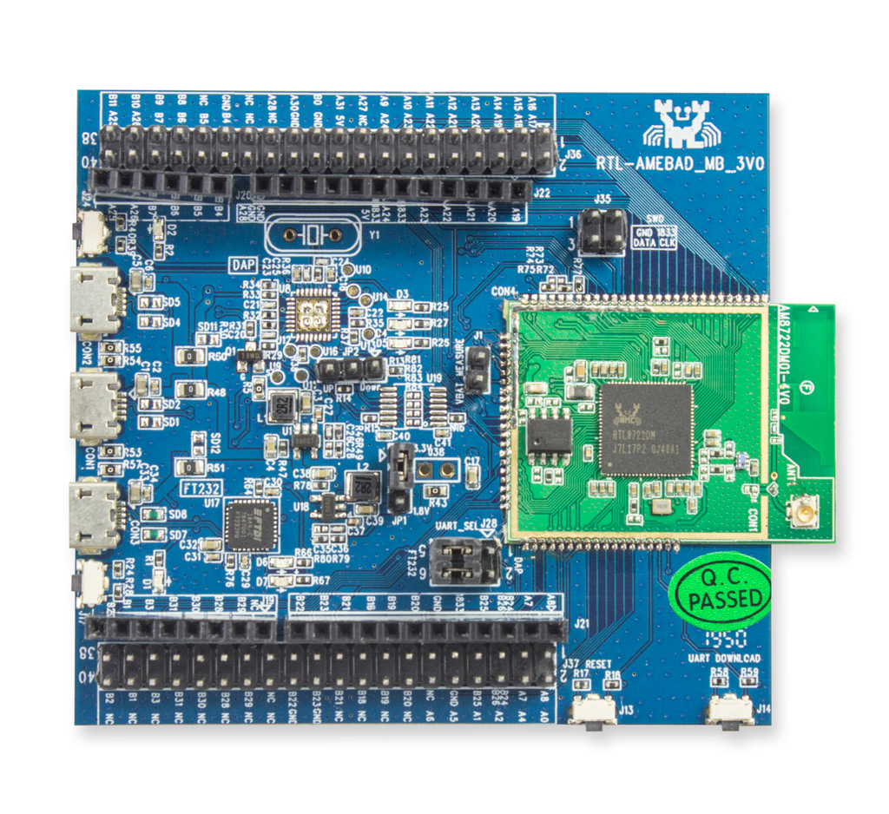

.. Copyright 2020-2023 MicroEJ Corp. All rights reserved._
.. Use of this source code is governed by a BSD-style license that can be found with this software._

.. |BOARD_NAME| replace:: Ameba RTL8722DM
.. |BOARD_REVISION| replace:: RTL-AMEBAD_MB_3V0
.. |VEEPORT_VER| replace:: 1.0.2
.. |RCP| replace:: MICROEJ SDK
.. |VEEPORT| replace:: VEE Port
.. |VEEPORTS| replace:: VEE Ports
.. |SIM| replace:: MicroEJ Simulator
.. |ARCH| replace:: MicroEJ Architecture
.. |CIDE| replace:: MICROEJ SDK
.. |RTOS| replace:: FreeRTOS RTOS
.. |MANUFACTURER| replace:: Realtek
.. |MANUFACTURER_SDK_VER| replace:: 6.2_patch_integrated_220728_48de91fa
.. |TOOLCHAIN| replace:: IAR Embedded Workbench for Arm
.. |TOOLCHAIN_VER| replace:: 8.32.1

.. _README MicroEJ BSP: ../../Ameba-RTL8722DM-bsp/README.rst
.. _RELEASE NOTES: ../../RELEASE_NOTES.rst
.. _CHANGELOG: ../../CHANGELOG.rst

==========================================
 |MANUFACTURER| |BOARD_NAME| 的 |VEEPORT| 
==========================================

本项目用来为 |BOARD_NAME| 开发板构建 |VEEPORT| .

相关文件
=============

本目录同时包含以下文件:

* `CHANGELOG`_ 用来跟踪MicroEJ |BOARD_NAME|  |VEEPORT| 代码改动
* `RELEASE NOTES`_  会列出:

  - 支持的硬件,
  - 已知问题和限制,
  - 开发环境,
  - 依赖代码列表及版本.

* `README MicroEJ BSP`_ 建议用户熟悉 |MANUFACTURER| 的SDK以及创建自定义构建过程等高级用法。 
*  |MANUFACTURER| SDK的版本是 |MANUFACTURER_SDK_VER|.

开发板技术规格
==============================

.. list-table::
  
  * - Name
    - |BOARD_NAME|
  * - Revision
    - |BOARD_REVISION|
  * - MCU part number
    - RTL8722DM-VA1-CG-QFN88
  * - MCU revision
    - N/A
  * - MCU architecture
    - Dual CPU, 32-bit Arm Cortex-M33 (KM4) and 32-bit Arm®Cortex®-M0 (KM0)
  * - MCU max clock frequency
    - KM4: 200 MHz, KM0: 20 MHz
  * - Internal flash size
    - N/A
  * - Internal PSRAM size
    - 4 MB
  * - Internal SRAM size
    - KM4: 512 kB, KM0: 64 kB
  * - SPI flash size
    - 2 MB
  * - Power supply
    - USB

如果你创建了 |MANUFACTURER| 账户,你可以通过 `here <https://www.amebaiot.com/en/amebad/>`__ 获取以下常用文档:

- Board schematics
- Board layout 
- Board Reference Manual 
- MCU Datasheet

VEE Port规格
=======================

Architecture 版本号 ``7.16.0``.

本 |VEEPORT|  提供下面的基础库:

.. list-table::
   :header-rows: 1

   * - Foundation Library
     - Version
   * - BON
     - 1.4
   * - ECOM-NETWORK
     - 2.1
   * - ECOM-WIFI
     - 2.2
   * - EDC
     - 1.3
   * - FS
     - 2.0
   * - NET
     - 1.1
   * - NLS
     - 2.0 
   * - SECURITY
     - 1.3
   * - SNI
     - 1.4
   * - SP
     - 2.0  
   * - SSL
     - 2.2
   * - TRACE
     - 1.1
   * - WATCHDOG 
     - 2.0 

|VEEPORT| 可以分为:

- Mono-Sandbox  |VEEPORT|   (默认)

需求列表
============

- Windows 10
- 互联网可以连接到 `MicroEJ Central Repository <https://developer.microej.com/central-repository/>`_ 
- |RCP| 发行版 ``20.12`` 或者更高,  `下载 <https://developer.microej.com/get-started/>`_
- |BOARD_NAME| 开发板

Board Setup 开发板设置
======================

Power Supply 供电
-----------------

开发板可以用USB线缆供电.

请参考  |MANUFACTURER| 文档 `here
<https://www.amebaiot.com/en/amebad/>`__
获得更多信息.

Programming 烧写
--------------------

 |BOARD_NAME| 开发板可以使用 |MANUFACTURER| bootloader 烧写. 
 请按下列步骤操作:

- 将开发板通过USB接口连接到计算机
- 找到新出现的COM口
- 编辑
  ``Ameba-RTL8722DM-bsp/Projects/microej/project/EWARM-RELEASE/run.xxx``
  脚本 (Windows ``xxx`` 是 ``bat``, Linux /
  macOS 是 ``sh`` ). 
- 打开命令行终端输入下面的命令:

**On Windows:**

.. code-block:: sh

      $ cd "xxx/Ameba-RTL8722DM-bsp/Projects/microej/project/EWARM-RELEASE/"
      $ run.bat 

固件烧写开始后,请等待下面的消息:

.. code-block::

      Leaving...
      Hard resetting via RTS pin...

|MANUFACTURER| 编译和烧写也可参考文档 `README MicroEJ BSP`_

Logs Output 日志输出
--------------------

MicroEJ  |VEEPORT|  使用 |BOARD_NAME| USB 虚拟 UART. 在使用USB连接开发板到计算
机时, 会自动加载一个COM口. 开发板所有的日志都通过这个COM口输出.

COM口使用下面的参数:

.. list-table::
   :widths: 3 2

   * - Baudrate
     - 115200
   * - Data bits bits
     - 8
   * - Parity bits
     - None
   * - Stop bits
     - 1
   * - Flow control
     - None

烧写后,预编译的应用会从UART口输出 ``Hello World`` .

Debugging 调试
--------------

Ameba-D 开发板支持使用J-Link或者SWD调试和烧写镜像(Image). 每个CPU的镜像可以单独烧写.

请参考 `README MicroEJ BSP`_ 章节获取更多详细信息.

|VEEPORT|  Setup  |VEEPORT|  配置
==================================

|VEEPORT|  Import  |VEEPORT|  导入
-----------------------------------

在 |RCP| Workspace 里导入工程:

- ``File`` > ``Import`` > ``Existing Projects into Workspace`` >
  ``Next``
- ``Select root directory`` 选择克隆好的工程。
- 点击 ``Finish``

在 |RCP| 里可以看到, 选择的示例被导入为几个以给定名称为前缀的工程:

- ``Ameba-RTL8722DM-configuration``: 包含 |VEEPORT|  配置说明,
  一些模块的配置文件放在指定的子目录下/或者使用配置文件
  (``.properties`` and / or ``.xml``)。

- ``Ameba-RTL8722DM-bsp``: 包含 |BOARD_NAME| 开发板上已经
  测试通过的BSP软件工程文件, 一个 |CIDE| 工程, 一个移植好在 |RTOS| 上的
  MicroEJ 核心(包括扩展模块) 和 |BOARD_NAME| 开发板的支持包。

- ``Ameba-RTL8722DM-fp``: 包含用于 |SIM| 的开发板配置。
  这个工程在每次 MicroEJ  |VEEPORT|  重新生成的时候更新。

- ``Ameba-RTL8722DM-platform``:
  MicroEJ |VEEPORT|  重新生成后,这个目录会产生 |RCP|  |VEEPORT|  工程文件。

默认情况, MicroEJ |VEEPORT|  配置为 Mono-Sandbox 评估模式。

|VEEPORT|  Build  |VEEPORT|  构建
----------------------------------

要生成MicroEJ |VEEPORT|  , 请按下列步骤执行:

- 在 |RCP| 里右键点击 ``Ameba-RTL8722DM-configuration``.
- 点击 ``Build Module``

生成过程随后开始。 这个过程将会持续几分钟。首先,会从MicroEJ Central 
Repository下载相关模块。你可以在MicroEJ console里看到生成过程的日志。

请等待最终完成消息:

.. code-block::

                          BUILD SUCCESSFUL

最终 |BOARD_NAME| 开发板的 |VEEPORT| 会全部生成并且链接到 |CIDE|
工程.

|RCP| 里的 ``Ameba-RTL8722DM-platform``
 |VEEPORT|  工程不应该有任何报错.

请参考
https://docs.microej.com/en/latest/ApplicationDeveloperGuide/standaloneApplication.html
获取更多如何生成MicroEJ Standalone应用的信息.

构建应用程序需要评估版许可证。有关如何获取和激活license的信息,请参考https://docs.microej.com/en/latest/overview/licenses.html#evaluation-license.

如何在评估或生产模式下编译 |VEEPORT|  
----------------------------------------------------------

* 打开位于 ``Ameba-RTL8722DM-configuration project`` 的文件 ``module.properties`` .
* 更新属性 ``com.microej.platformbuilder.architecture.usage`` 的值选择要构建 |VEEPORT|  的模式(评估或生产模式)   
	* 如果要在评估模式下构建 |VEEPORT|  ,则将此属性的值设置为 ``eval`` ; 如果要在生产模式下构建 |VEEPORT|  ,则将该值设置为 ``dev``.
	* 保存 ``module.properties`` 文件.
* 右键单击 ``Ameba-RTL8722DM-configuration`` 工程,然后单击 ``Build Module`` 构建 |VEEPORT|  .

工作空间中将生成名为 ``Ameba-RTL8722DM-platform`` 的 |VEEPORT|  工程.

在SDK中导入生成的 |VEEPORT|  工程:

* ``File`` > ``Import`` > ``General`` > ``Existing Projects into Workspace`` > ``Next``.
* 选择 ``Directory`` > ``Browse…``
* 浏览并选择 ``Ameba-RTL8722DM-platform`` 目录.
* 单击 ``Finish`` 以导入 |VEEPORT|  .

你可以在 ``Platforms in workspace`` 菜单中看到该 |VEEPORT|  :

* ``Window`` > ``Preferences`` > ``MicroEJ`` > ``Platforms in workspace``

至此, |VEEPORT|  已经构建好了,可以用来构建应用程序了。

BSP Setup BSP配置
=================

- 安装版本 |TOOLCHAIN_VER| 的 |TOOLCHAIN|. 
  你可以访问 `here <https://www.iar.com/products/architectures/arm/iar-embedded-workbench-for-arm/>`__ 获得工具链的正确版本.
- 安装 J-LINK 工具 `here <https://www.segger.com/downloads/jlink/>`__.

Windows Toolchain 工具链
------------------------
- C/C++ toolchain name: IAR compiler
- C/C++ toolchain version: 8.3
- C/C++ toolchain download link: https://www.iar.com/products/architectures/arm/iar-embedded-workbench-for-arm

BSP Compilation 编译
--------------------
 |VEEPORT|  提供了预编译的 Mono-Sandbox 应用. 通过编译BSP工程,可以验证BSP安装,并且构建MicroEJ固件。

若要编译 ``Ameba-RTL8722DM-bsp`` 工程, 打开
命令行终端 并输入下列命令:

**On Windows:**

找到位于 ``sdk-amebad_v6.2C-RC`` 文件夹中的MicroEJ的patch,使用 ``git patch`` 给工程打上补丁

.. code-block:: sh

      $ cd "xxx/Ameba-RTL8722DM-bsp/Projects/"
      $ git apply sdk_patched_by_microej.patch

编译 bsp 工程
.. code-block:: sh

      $ cd "xxx/Ameba-RTL8722DM-bsp/Projects/microej/project/EWARM-RELEASE/"
      $ build.bat 

BSP工程编译开始后, 请等待最终消息输出:

.. code-block::

      1 File(s) copied.

build脚本期望工具链安装在一个已知的路径上. 如果你在其他地方安装了它,请参阅 `README MicroEJ BSP` 了解如何自定义其路径。
请参考 `README MicroEJ BSP` 获取IAR项目的路径,并了解如何定制build脚本的更多详细信息.

Testsuite Configuration 测试集配置
==================================

重要的是,你需要将MICROEJ SDK更新到Dist. 21.11,以便能够启动验证测试集。

第一步是在工作区中导入位于文件夹 ``Ameba-RTL8722DM-validation/`` 测试集中的runner项目.

要在 |BOARD_NAME| 板上运行测试集,标准输出必须重定向到专用的UART. 务必设置测试集中的 ``config.properties`` 文件中的属性
``microej.testsuite.properties.debug.traces.uart`` .

因此,开发板需要连接到笔记本电脑上,使用J-link来烧写开发板,并使用USB转UART来接收开发板输出的日志。
然后,你需要使用 Serial-to-Socket Transmitter创建一个工具配置项. 这将允许测试及引擎从UART检索开发板输出的日志。
具体步骤如下：

1. 打开 ``Run > Run Configuration``
2. 右键单击 ``MicroEJ Tool`` 并选择 ``New configuration``.
3. 在target区域, 选择正确的 |VEEPORT|  
4. 在Execution区域的 ``Settings`` 下拉菜单选择 ``Serial-to-Socket Transmitter`` 
5. 然后, 进入 ``Configuration`` 标签,根据开发板的UART配置 ``Baudrate`` ,并根据服务器端口号配置 ``Port`` 为 ``5555``.
6. 单击应用并运行.确保你用于读取串口输出的软件(如 ``Putty`` )已关闭.

关于Serial To Socket Transmitter的更多信息请参考:
https://docs.microej.com/en/latest/ApplicationDeveloperGuide/serialToSocketTransmitter.html

在 ``config.properties`` 文件中, 属性 ``target.platform.dir`` 必须设置成 |VEEPORT|  的绝对路径. 例如:
``target.platform.dir=C:/P0236_Ameba-RTL8722DM-Platform/Ameba-RTL8722DM-Platform/source``.

如果你遇到了路径过长的问题,可以在每个测试集的runner项目的 ``module.ivy`` 文件中配置目标文件夹路径.
把 ``value`` 设置为short path以注释掉编译属性这一行 ``<!--ea:property name="target" value="<short_path>"/-->`` .

当一切就绪, 在 ``Package explorer`` 中, 右键单击 java testsuite runner 项目并选择 ``Build module`` . 最终, 测试集将正确的启动.
你可以在文件夹 ``target~/test/html/test/`` 中找到 html 格式的测试集运行报告.

Testsuite FS 测试集FS
---------------------

``Ameba-RTL8722DM-validation/java-testsuite-runner-fs/`` 提供了测试集runner工程的特定的 ``config\.properties`` 和 ``microej-testsuite-common.properties`` .

Testsuite NET 测试集 NET
------------------------

``Ameba-RTL8722DM-validation/java-testsuite-runner-net/`` 提供了测试集runner工程的特定的 ``config\.properties`` 和 ``microej-testsuite-common.properties`` .

Testsuite Ecom-Network-Wifi 测试集Ecom-Network-Wifi
---------------------------------------------------

``Ameba-RTL8722DM-validation/java-testsuite-runner-ecom-network-wifi/`` 提供了测试集runner工程的特定的 ``config\.properties`` 和 ``microej-testsuite-common.properties`` .

Testsuite Ecom-Wifi 测试集Ecom-Wifi
-----------------------------------

``Ameba-RTL8722DM-validation/java-testsuite-runner-ecom-wifi/`` 提供了测试集runner工程的特定的 ``config\.properties`` 和 ``microej-testsuite-common.properties`` .

Testsuite SSL 测试集SSL
-----------------------

``Ameba-RTL8722DM-validation/java-testsuite-runner-ssl/`` 提供了测试集runner工程的特定的 ``config\.properties`` 和 ``microej-testsuite-common.properties`` .

Testsuite WatchdogTimer 测试集WatchdogTimer
--------------------------------------------

``Ameba-RTL8722DM-validation/java-testsuite-runner-watchdog-timer/`` 提供了测试集runner工程的特定的 ``config\.properties`` 和 ``microej-testsuite-common.properties`` .

Troubleshooting 故障排除
========================

如果build失败,并提示错误信息 ``The project cannot be overwritten`` :
--------------------------------------------------------------------

* 关闭 MicroEJ SDK
* 进入工作空间目录并删除工程文件夹 ``Ameba-RTL8722DM-platform``
* 启动MicroEJ SDK并重新build

请参考 `README MicroEJ BSP`_ 文件中的相同名称的部分.